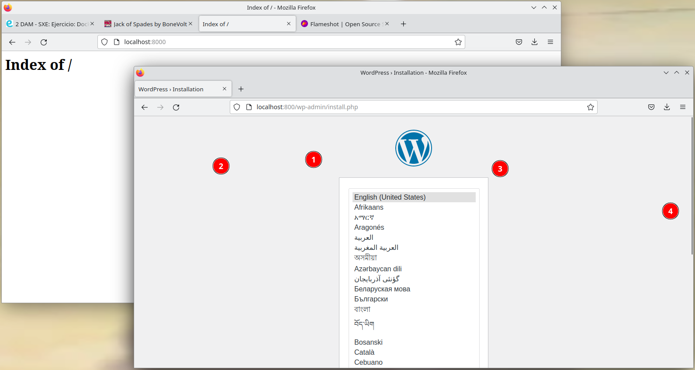

### Instalación de Docker
Acá aprenderemos 
## Servicios del archivo yaml
Crea tres contenedores. Uno de apache y otro de MariaDB y otro más de wordpress.Estos tres contenedores son dam_apache,dam_mdb y dam_wordpress.
Usará una imágen de la versión mas reciente de apache y wordpress junto con la version 10.6.4-focal de mariadb.
para acceder al servidor apache necesitas usar el puerto 8000. Para acceder al servidor de wordpress necesitas el puerto 800.
# Partes específicas de las bases de datos en MariaDB y Wordpress.
Maríadb usará esta base de datos con estas carácterísticas:
-Tendrás la base de datos wordpress con el usuario juan.
-El nombre del superusuario(root) y la contraseña son los mismos: castelao
Cualquier contenedor que hagas podrá acceder a través de los puertos de mariadb 3306 y 33060.
Wordpress usará esta base de datos con estas características:
-Tendrás la base de datos wordpress con el usuario juan
-El nombre del superusuario(host) es db y la contraseña será castelao.
Habrá dos archivos de volumen una vez levantado este docker compose. El de mariadb será en el archivo var/lib/mysql y el docker estará en var/www/html.
